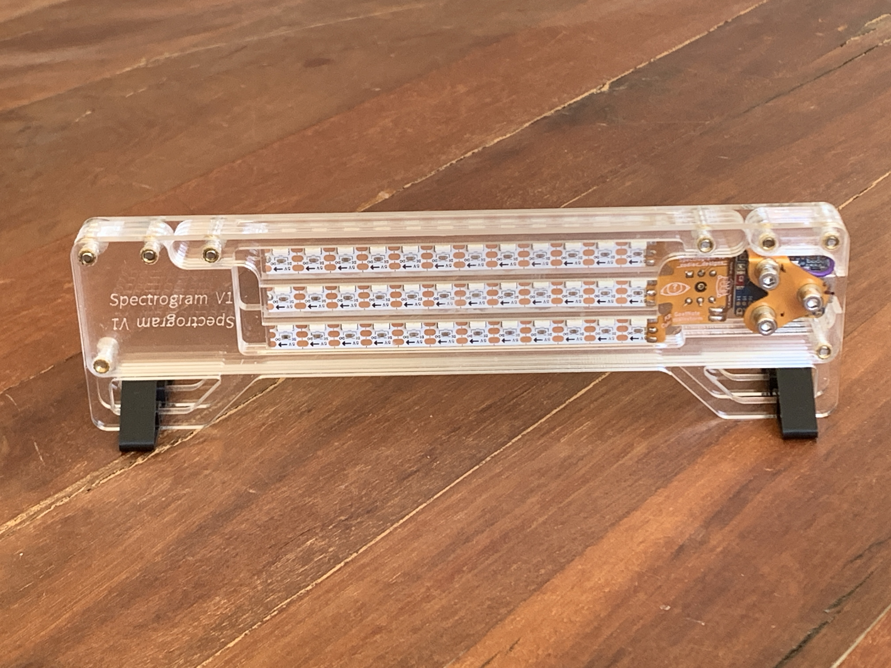
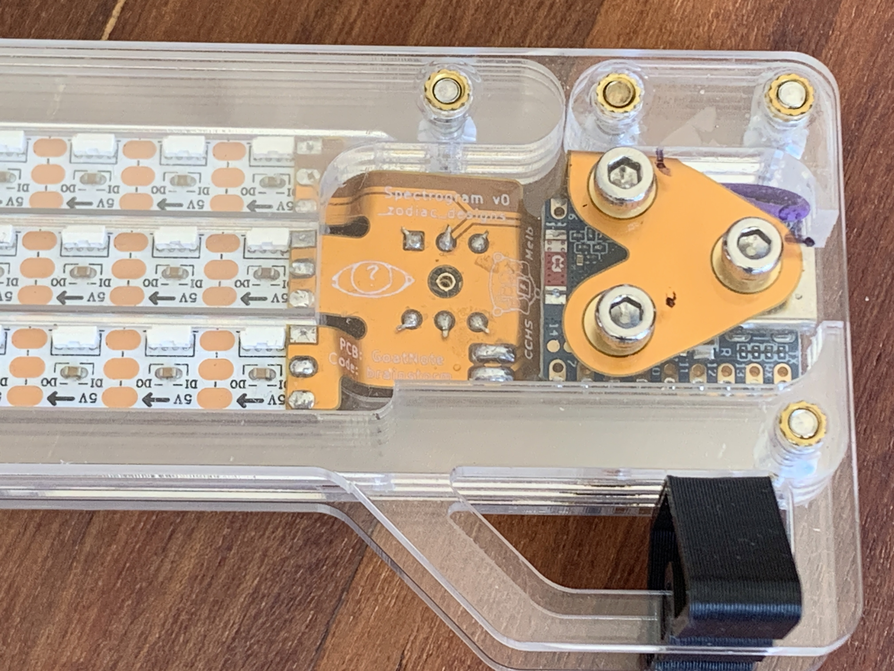

# Spectrogram 



It's a 36 LED stack of neopixels joy with an integrated microphone, running MicroPython:

* Audio reactive LEDs
* Acrylic-ready, to show off your creative animations
* Stepped structure to elimate gaps between edge-lit panels
* Touch-enabled to switch between all its range of features


### Building

To build the firmware it helps to use `mpbuild` like so, since this hardware will not work without `ulab`:

```
$ git clone https://github.com/mattytrentini/mpbuild && cd mpbuild
$ git clone https://github.com/v923z/micropython-ulab ulab
$ python3 -mvenv .venv && source .venv/bin/activate && pip install -e .
(.venv)$ mpbuild build ESP32_GENERIC_S3 FLASH_4M USER_C_MODULES=$PWD/ulab/code/micropython.cmake all
```

The resulting object you want to flash with the `esptool.py` command from the previous section is typically named `firmware.bin`.

### Running

```sh
cd software/micropython
./run.sh
```

### Closeup

Uoooohhh


